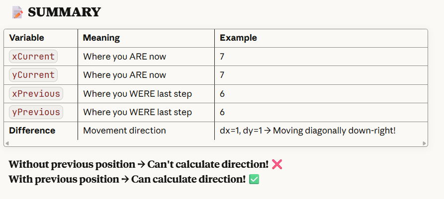

# 🎮 Player System Documentation

> **Complete guide to the Player character system in our Habbo Hotel-style multiplayer game**

## 📂 PlayerMovement
[`../src/Entity/Player.java`](../src/Entity/PlayerMovement.java)

**purpose**: 

---

## 📂 PlayerAnimator
[`../src/Entity/Player.java`](../src/Entity/PlayerAnimator.java)

**
 * PlayerAnimator - Handles sprite animation
 * 
 * Responsibilities:
 * - Animate sprite frames
 * - Track animation state
 * - Provide current frame number
 * 
 * Single Responsibility: ANIMATION
 **
---

## 📂 PlayerRenderer
[`../src/Entity/Player.java`](../src/Entity/PlayerRenderer.java)

/ **
 * Responsibilities:
 * - Load sprite images
 * - Select correct sprite based on state
 * - Draw player sprite
 * - Draw typing indicator
 * - Coordinate conversion (map → screen)
 * - Hitbox detection
 * 
 * Single Responsibility: RENDERING
 **/

## 📂 PlayerNetworkSync
[`../src/Entity/Player.java`](../src/Entity/PlayerNetworkSync.java)
/**
 * PlayerNetworkSync - Handles network synchronization
 * 
 * Responsibilities:
 * - Send position updates to server
 * - Track previous state to avoid redundant updates
 * - Manage network connection
 * 
 * Single Responsibility: NETWORK COMMUNICATION
 */

 

